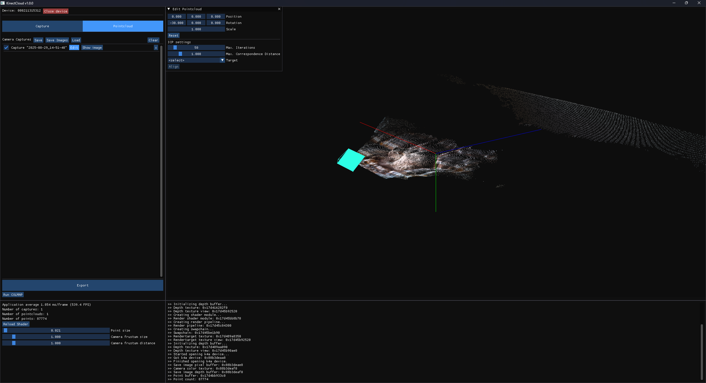

# KinectCloud

**KinectCloud** ist eine Windows-basierte C++-Anwendung zur Aufnahme und Verarbeitung von Punktwolken mithilfe einer **Azure Kinect Kamera** für die weitere Verwendung in [3D Gaussian Splatting](https://repo-sam.inria.fr/fungraph/3d-gaussian-splatting/) im Rahmen einer Bachelorthesis.

## Features

- Integration der **Azure Kinect Kamera** zur Erfassung von RGB- und Tiefendaten  
- gleichzeitige Aufnahme von RGB- und Tiefendaten
- Generierung von Punktwolken aus den Tiefendaten
- 3D-Visualisierung von Punktwolken mit **WebGPU**
- grobe manuelle Ausrichtung der Punktwolken
- feine automatische Ausrichtung der Punktwolken durch ICP
- Export der Punktwolken und Kameraposen für [3D Gaussian Splatting](https://repo-sam.inria.fr/fungraph/3d-gaussian-splatting/)

<table>
  <tr>
    <td>
      
    </td>
    <td>
      
    </td>
  </tr>
</table>

## Voraussetzungen

### Abhängigkeiten

- **CMake** (≥ 3.0, empfohlen ≥ 3.20)  
- **C++20 Compiler** (MSVC, Clang oder GCC)  
- Azure Kinect SDK v1.4.2
- [vcpkg](https://github.com/microsoft/vcpkg) (zur Installation von [PCL (Point Cloud Library)](https://pointclouds.org/))  
- **Libraries (im Projekt enthalten):**
  - [GLFW](https://github.com/glfw/glfw)
  - [WebGPU (Dawn)](https://dawn.googlesource.com/dawn)
  - [ImGui](https://github.com/ocornut/imgui)

## Installation

### 1. Repository herunterladen/klonen

- `git clone https://github.com/NRiedinger/KinectCloud.git`

### 2. Abhängigkeiten installieren

#### Azure Kinect SDK

- Lade den Installer [Azure Kinect SDK 1.4.2.exe](https://github.com/microsoft/Azure-Kinect-Sensor-SDK/blob/develop/docs/usage.md#installation) herunter und installiere diesen.

- Passe den Installationspfad für das Azure Kinect SDK (z.B. *C:/Program Files/Azure Kinect SDK v1.4.2*) in *CMakeLists.txt* an:
```cmake
# set path of your Azure Kinect SDK installation (e.g. "C:/Program Files/Azure Kinect SDK v1.4.2")
set(KINECT_SDK_PATH "C:/Program Files/Azure Kinect SDK v1.4.2")
```

#### VCPKG

- Repository klonen mit `git clone https://github.com/microsoft/vcpkg.git`
- *bootstrap-vcpkg.bat* im geklonten Ordner ausführen
- Passe den Pfad zu `{vcpkg}/scripts/buildsystems/vcpkg.cmake` in *CMakeLists.txt* im KinectCloud-Projekt an:
```cmake
# set path to your vcpkg.cmake file (e.g. "C:/vcpkg/scripts/buildsystems/vcpkg.cmake)")
include(C:/vcpkg/scripts/buildsystems/vcpkg.cmake)
```

#### PCL
- Installiere die Point Cloud Library mit `vcpkg install pcl`

### 3. Projektdateien erstellen

- Baue das Projekt durch die Ausführung von *make.bat*
